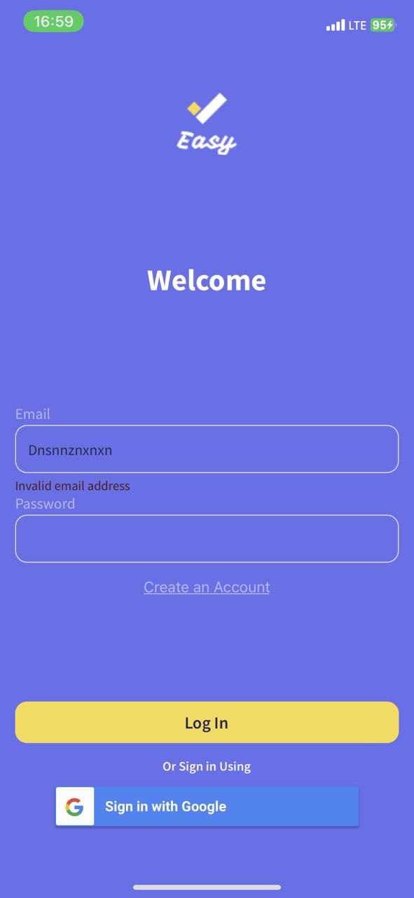

<h1 align="center" id="title">React Native Planner App</h1>

The React Native Planner App is a versatile and intuitive mobile application designed to enhance your task management experience. With a primary focus on providing users with a seamless way to organize their tasks, this app goes beyond the standard planner by incorporating advanced features, including geolocation integration.

<h2>Project Screenshots:</h2>

<h3>User Auth page</h3>

To auth, user can use email or google auth, users data stors on firebase

  
User Auth page screen

<h3>Task list page</h3>

Page with all user tasks. User can filter task list by ready statys

  
Task list page screen

   
   

<h3>Map page</h3>

Map page. Markers with tasks are on the map. When you click on a task, displaing task info.

  
Map page screen

<h3>Add task page</h3>

On the page, add a task, the user creates task, the task type and name fields are required. The user can also add an image from the gallery. The user can also select the task location on the map

  
Add task page screen

   

<h3>Chart page</h3>

Chart page, weekly, monthly and yearly statistic

  
Chart page screen

    

  
  
<h2>🧐 Features</h2>

Here're some of the project's best features:

### Geolocation Integration
The app enables users to attach geolocation information to their tasks, adding a spatial context to their schedules. This feature is particularly useful for tasks that are location-dependent, allowing users to efficiently plan their activities based on their physical surroundings.

### User Authentication
Ensuring the security and privacy of user data is paramount. The app incorporates a robust user authentication system, allowing users to log in using either their email or Google credentials. User data is securely stored on Firebase, providing a reliable and scalable authentication solution.

### Task List Management
The task list page provides an at-a-glance view of all user tasks. Users can easily filter and organize their tasks based on completion status, ensuring a clear overview of their ongoing and completed activities.

### Interactive Map View
The map page enhances task visualization by displaying markers corresponding to task locations. Users can interact with the map, clicking on markers to view detailed task information. This feature is especially beneficial for users with tasks spread across different locations.

### Effortless Task Creation
Adding tasks is a breeze with the dedicated "Add Task" page. Users can specify task type and name (required fields), upload images from their gallery, and even select task locations directly on the map. This comprehensive approach to task creation caters to a variety of user preferences and needs.

### Statistical Insights with Charts
The app goes beyond basic task tracking by offering insightful charts. Users can analyze their task completion trends on a weekly, monthly, and yearly basis, empowering them with data-driven insights into their productivity patterns.

  
  
<h2>💻 Built with</h2>

Technologies used in the project:

*   React Native
*   Typescript
*   Firebase
*   Redux toolkit
